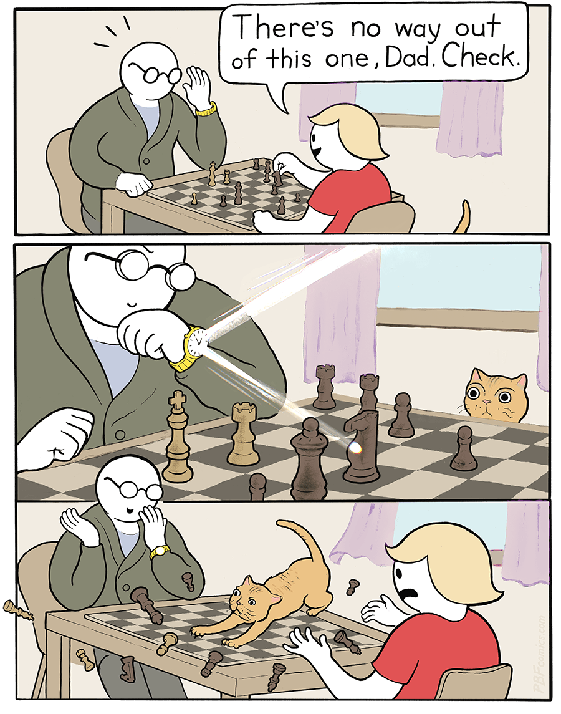

# Flappy Bird Java

A Flappy Bird clone implemented in Java using Swing. Desktop game where a bird navigates through pipes via spacebar-controlled flapping, with score tracking and state-based gameplay (MENU, PLAYING, GAME_OVER).

## How to Run

Compile and run with Java:

```
javac src/*.java -d out
java -cp out Main
```

Or open in an IDE (IntelliJ, Eclipse, VS Code) and run `Main.java`.

Requires Java 8 or higher. No external dependencies.

## Controls

| Key      | Action                          |
|----------|---------------------------------|
| Space    | Flap (in PLAYING)               |
| Space    | Start game (in MENU)            |
| Space    | Restart (in GAME_OVER)          |

## Features

- Fixed-timestep game loop at ~60 FPS via `javax.swing.Timer`
- Gravity and flap physics with configurable constants
- Scrolling pipes with random gap positions, spawning every 1.5 seconds
- Forgiving collision detection (3px padding on bird hitbox)
- Score display with high score tracking (per session)
- Three game states: MENU, PLAYING, GAME_OVER

## Project Structure

```
src/
  Main.java          - Entry point, JFrame setup
  Constants.java     - Shared constants (dimensions, physics, colors)
  GamePanel.java     - Game loop, state machine, rendering, input
  Bird.java          - Bird entity with physics and bounds
  Pipe.java          - Single pipe pair
  PipeManager.java   - Pipe spawning, movement, cleanup
scripts/
  scrape_pbfcomics.py - PBF Comics scraper (secondary feature)
plans/
  plan.md            - Design document
```

## Technical Details

- **Game Loop:** Fixed timestep (16ms intervals), delta time constant at 0.016s
- **Collision:** AWT `Rectangle.intersects()` with shrunk hitbox for forgiveness
- **Rendering:** Anti-aliased via `RenderingHints`, ordered: background -> pipes -> ground -> bird -> score -> UI
- **State Machine:** Three states (MENU, PLAYING, GAME_OVER) in GamePanel, updates only in PLAYING

## Secondary Feature: PBF Comics Scraper

The repository includes a Python script (`scripts/scrape_pbfcomics.py`) that scrapes the latest comic from [pbfcomics.com](https://pbfcomics.com/). A GitHub Actions workflow runs daily at 06:00 UTC, downloads the latest comic, and creates a PR.

The image at the top of this README is the latest scraped comic.

To run manually:

```
pip install requests beautifulsoup4
python scripts/scrape_pbfcomics.py
```

## License

MIT
